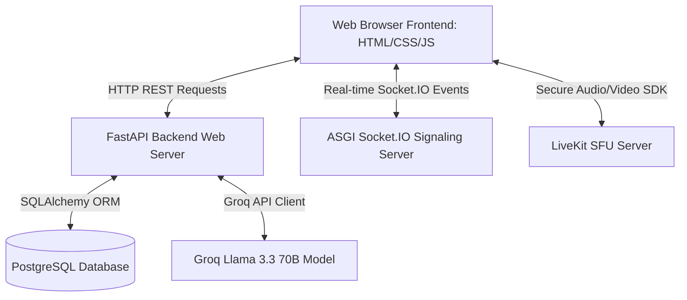
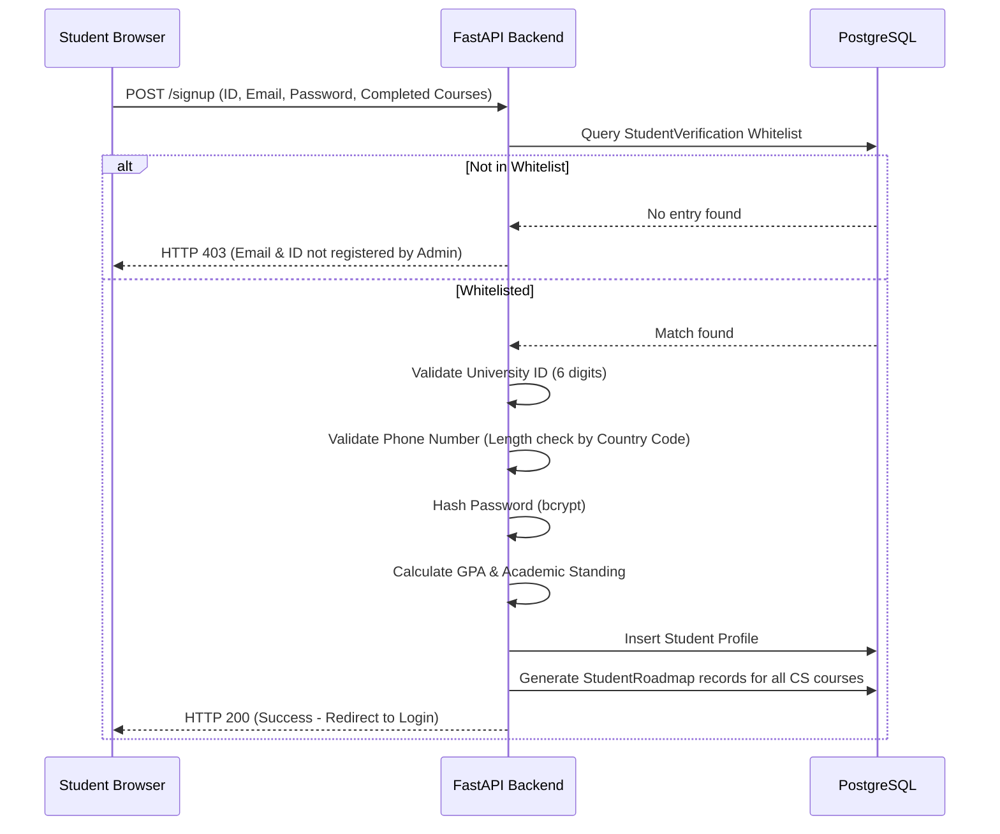
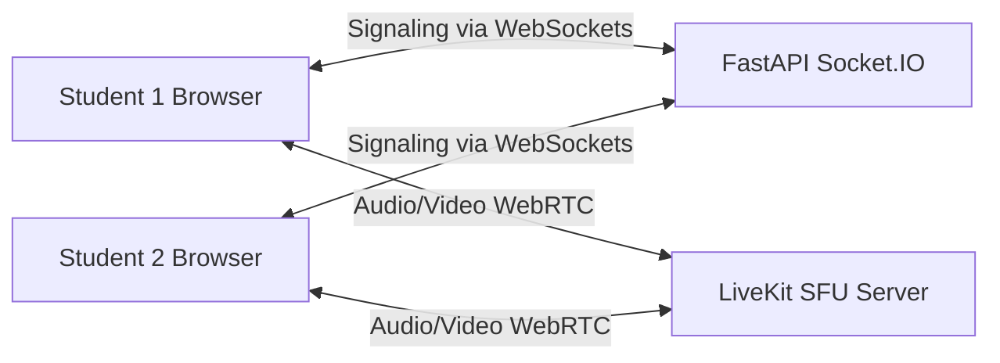

# CS Academic Advisor Chatbot - Comprehensive System Documentation

This document provides a highly detailed, A-to-Z technical overview of the **Jordan University of Science and Technology (JUST) CS Academic Advisor Chatbot & Portal**. It details the backend and frontend architectures, data models, logic flow, and specific features like the real-time Study Room system (LiveKit/WebRTC) and the AI Chatbot (Groq/Llama).

---

## 🛠️ 1. Architecture Overview

The system is designed with a lightweight, decoupled client-server structure:



### Backend Stack
*   **Web Framework**: **FastAPI** (ASGI standard) for high-performance async REST API endpoints.
*   **Database ORM**: **SQLAlchemy** connected to a **PostgreSQL** database instance.
*   **Real-time Communication**: **python-socketio** running in ASGI mode to handle socket connections.
*   **Audio/Video SFU**: **LiveKit Python SDK** to generate secure access tokens for WebRTC conferences.
*   **AI completions**: **Groq Python SDK** calling the `llama-3.1-8b-instant` or `llama-3.3-70b-specdec` models.
*   **Security & Hashing**: **Passlib** with `bcrypt` for secure hashing and validation of user passwords.

### Frontend Stack
*   **Structure & Logic**: **Vanilla HTML5, CSS3, and JavaScript**. No bloated JavaScript frameworks (like React/Angular) are used, ensuring extremely fast page load times and simple maintenance.
*   **Dynamic Templating**: A central [sidebar.js](file:///c:/Users/ahmad/OneDrive/Desktop/GP2%20Project%20Website/frontend/sidebar.js) file dynamically injects the sidebar layout, header, footer, and handles global authentication guards.
*   **Markdown Rendering**: **Marked.js** combined with **DOMPurify** to safely parse and display formatted AI markdown text while preventing XSS.

---

## 🗄️ 2. Database Schema & Models

All tables are defined as SQLAlchemy declarative models under `/backend/app/models/`:

### 1. `Student` ([student.py](file:///c:/Users/ahmad/OneDrive/Desktop/GP2%20Project%20Website/backend/app/models/student.py))
Represents a registered Computer Science student.
*   `university_id` (VARCHAR, PK): Unique 6-digit student ID.
*   `email` (VARCHAR): Academic email ending in `@cit.just.edu.jo`.
*   `first_name` / `last_name` (VARCHAR).
*   `password` (VARCHAR): Secure bcrypt password hash.
*   `phone_number` (VARCHAR): Formatted with international country code.
*   `major` (VARCHAR, Default: "Computer Science").
*   `current_gpa` (FLOAT, Default: 0.0): Calculated on a 4.2 scale.
*   `academic_standing` (VARCHAR): E.g., "first year", "second year", etc.
*   `completed_credits` (INTEGER, Default: 0).
*   `remaining_courses` (INTEGER, Default: 0).
*   `advisor_id` (VARCHAR, FK): Links to academic advisor's email.

### 2. `Course` ([course.py](file:///c:/Users/ahmad/OneDrive/Desktop/GP2%20Project%20Website/backend/app/models/course.py))
Stores the universal CS study plan curriculum courses.
*   `code` (VARCHAR, PK): E.g., `CS101`, `MATH241`.
*   `id_reg` (VARCHAR): Registration identifier in the university portal.
*   `name` (VARCHAR): Course title.
*   `prerequisites` (VARCHAR): Formatted string (e.g. `CS211` or `MATH241&CS101`).
*   `plan_type` (VARCHAR): Compulsory/Elective type categories.
*   `credit_hours` (INTEGER): Number of credit hours (mostly 1 to 3).
*   `suggested_year` / `suggested_semester` (INTEGER/VARCHAR).

### 3. `StudentRoadmap` ([student_roadmap.py](file:///c:/Users/ahmad/OneDrive/Desktop/GP2%20Project%20Website/backend/app/models/student_roadmap.py))
Tracks individual progression for each student.
*   `id` (INTEGER, PK).
*   `student_id` (VARCHAR, FK).
*   `course_code` (VARCHAR, FK).
*   `status` (VARCHAR): Completion status (`Completed`, `Currently Enrolled`, `Available`, `locked`).
*   `grade` (VARCHAR, Nullable): Final grade received (A+, B, F, etc.).
*   `year` / `semester` (INTEGER/VARCHAR).

### 4. `ChatbotHistory` ([chatbot_history.py](file:///c:/Users/ahmad/OneDrive/Desktop/GP2%20Project%20Website/backend/app/models/chatbot_history.py))
Maintains chat context for users.
*   `id` (INTEGER, PK).
*   `student_id` (VARCHAR, FK).
*   `message_content` (TEXT): The query or AI response.
*   `sender_type` (VARCHAR): Either `user` or `bot`.
*   `source` (VARCHAR, Nullable): Categorization (`official`, `general`, `demo`, `error`).
*   `confidence` (FLOAT, Nullable): Context keyword overlap score.
*   `timestamp` (DateTime).

### 5. `StudyRooms` System Tables ([study_rooms.py](file:///c:/Users/ahmad/OneDrive/Desktop/GP2%20Project%20Website/backend/app/models/study_rooms.py))
*   **`OfficialRooms`**: Generated automatically for curriculum courses. (1-to-1 relationship with `Course`).
*   **`PrivateStudyRooms`**: Student-created rooms. Contains fields `id`, `name`, `type` (Public/Private), `creator_id` (FK), and `password` (Nullable).
*   **`RoomMembers`**: Tracks active members inside active rooms. Fields: `id`, `room_id`, `room_type` (Official/Private), and `student_id`.

### 6. `CsFacultyInfo` ([cs_faculty_info.py](file:///c:/Users/ahmad/OneDrive/Desktop/GP2%20Project%20Website/backend/app/models/cs_faculty_info.py))
Stores information about Computer Science faculty and academic advisors.
*   `email` (VARCHAR, PK): Instructor's academic email.
*   `name` (VARCHAR): Instructor's full name.
*   `title` (VARCHAR, Nullable): Academic rank/title (e.g. Professor, Assistant Professor).
*   `office_location` (VARCHAR): Office room identifier.
*   `office_hours` (VARCHAR): Scheduled office hours availability.

### 7. `StudentVerification` ([student_verification.py](file:///c:/Users/ahmad/OneDrive/Desktop/GP2%20Project%20Website/backend/app/models/student_verification.py))
Acts as the sign-up verification whitelist.
*   `id` (INTEGER, PK): Auto-incrementing identifier.
*   `email` (VARCHAR, Unique): Whitelisted academic email.
*   `university_id` (VARCHAR, Unique): Whitelisted 6-digit university ID.

### 8. `Enrollment` ([enrollment.py](file:///c:/Users/ahmad/OneDrive/Desktop/GP2%20Project%20Website/backend/app/models/enrollment.py))
Tracks specific semesters and numeric grades.
*   `id` (INTEGER, PK).
*   `student_id` (VARCHAR, FK): Links to Student.
*   `course_code` (VARCHAR, FK): Links to Course.
*   `semester` (VARCHAR): Semester of enrollment.
*   `grade` (FLOAT): Numeric grade value.
*   `status` (VARCHAR): Completion status.

---

## 🔒 3. Authentication & Sign Up Flow

Account creation requires strict validation to guarantee data integrity:



### Form Input Validation Details
*   **University ID**: Enforces `maxlength="6"` and regular expressions (`/^\d{6}$/`) ensuring only a 6-digit numerical string is accepted.
*   **Phone Number**: Leverages a Country Code Select dropdown (+962, +966, etc.) which maps countries to their exact valid mobile digit length. Any typed leading zero is stripped dynamically via JavaScript on the frontend. The combined number (`+962791234567`) is sent to the backend.

---

## 🤖 4. AI Chatbot Logic (Groq & Llama)

The chatbot serves as a personalized AI academic advisor. It integrates several layers of custom business logic before returning responses:

### 1. Context Assembly
When a student queries `/chat/ai`:
1.  **Conversation Memory**: Loads the last 20 messages of the conversation from `ChatbotHistory`.
2.  **System Prompt Generation**: Injects the universal CS Study Plan (concatenated text files loaded from `/backend/knowledge_base/`) into the prompt block.
3.  **Student Profile Injection**: If a user is logged in, the backend builds a structured profile string containing their GPA, completed credits, currently enrolled courses, and remaining roadmap requirements. This is injected as a system instruction:
    ```
    --- BEGIN STUDENT PROFILE ---
    Student Name: Ahmad Al-Zyoud
    Current GPA: 3.25
    Completed Credits: 45 / 132
    ...
    --- END STUDENT PROFILE ---
    ```

### 2. Answer Classification Heuristic
To prevent hallucinations and clearly distinguish certified university guidelines from general AI generation, the engine runs a keyword overlap classifier:
*   Tokens from the query are extracted (filtering out common stop-words defined in `_STOP_WORDS`).
*   The system measures the overlap ratio between query tokens and the knowledge base token set.
*   If the overlap score is **$\ge 0.30$**, the response source is marked as **`official`** (rendered with an "Official Source" badge and matching similarity percentage).
*   Otherwise, it is flagged as **`general`** ("AI-Generated Insight" badge).

### 3. Fault Tolerance & Production Exception Wrapping
To protect the app from API failures, all completion calls are wrapped in a robust try-except block. If Groq triggers a billing, rate-limit, key expiration, or invalid argument error, it catches the exception and returns a formatted text message outlining alternative tools the student can use (Roadmap, GPA Calculator) instead of showing raw code errors.

---

## 👥 5. Real-time Study Rooms (WebRTC & Socket.IO)

The Study Room system provides a dual signaling and audio-video stack, allowing students to collaborate in real time.



### 1. Room Isolation
*   **Official Study Rooms**: The system dynamically fetches the student's enrolled courses. It displays **only** the study rooms associated with courses they are currently taking.
*   **Private Study Rooms**: Any student can create a private room (protected by a password) or a public study room.

### 2. LiveKit SFU Integration (Production Mode)
When a user joins a room, the frontend requests a room token via `/rooms/token?room_id=...&student_id=...`.
*   The backend retrieves `LIVEKIT_API_KEY` and `LIVEKIT_API_SECRET` from environment variables.
*   It instantiates an `AccessToken` using the LiveKit SDK, setting the participant's name, student ID, and granting room-joining privileges.
*   The returned JWT token is sent to the frontend, which initializes the `livekit-client` SDK and establishes a direct WebRTC connection with the LiveKit SFU server.

### 3. Socket.IO Signaling Relay (Fallback/Control Mode)
For syncing room states, user lists, and relaying standard WebRTC connections (when LiveKit is not used), a custom WebSocket signaling protocol is registered in [signaling_controller.py](file:///c:/Users/ahmad/OneDrive/Desktop/GP2 Project Website/backend/app/api/signaling_controller.py):
*   `join_room`: Registers the socket `sid` in the global `room_participants` dictionary, tracks user names, and emits `user-joined` to other room occupants.
*   `offer` / `answer` / `ice_candidate`: Transmits standard peer-to-peer WebRTC connection payloads directly between two socket client sessions (`to=target`).
*   `toggle_media`: Broadcasts changes in microphone/camera states to update the UI on other clients.
*   `disconnect` / `leave_room`: Safely clears the participant from lists, updates user counts, and notifies peers.

### 4. Lobby/Green Room Preview
Before entering a call, the student is held in a Lobby preview state (handled inside [room.html](file:///c:/Users/ahmad/OneDrive/Desktop/GP2 Project Website/frontend/room.html)). It hooks into local media:
*   `navigator.mediaDevices.getUserMedia({ video: true, audio: true })` displays local webcam feed in a preview canvas.
*   Provides buttons to toggle camera and microphone status before establishing peer connections.

### 5. Persistent Mini-Meeting Widget
If a student is in a live call and decides to check their Roadmap or GPA calculator, [sidebar.js](file:///c:/Users/ahmad/OneDrive/Desktop/GP2 Project Website/frontend/sidebar.js) detects the active call session (`sessionStorage.getItem('active_meeting')`).
*   It dynamically builds and appends an overlay widget (`#miniMeetingWidget`) on the bottom-right corner of the new page.
*   The widget captures local video and contains a "Return" button (which routes back to the active call screen) and a "Leave" button (which triggers the API `/rooms/leave` and disconnects the media tracks).

---

## 📈 6. Core Student Tools & Pages

### 1. Degree Roadmap ([roadmap.html](file:///c:/Users/ahmad/OneDrive/Desktop/GP2%20Project%20Website/frontend/roadmap.html) / [roadmap.js](file:///c:/Users/ahmad/OneDrive/Desktop/GP2%20Project%20Website/frontend/roadmap.js))
Renders the student's degree progression on a grid:
*   Queries `/roadmap/{student_id}` to retrieve courses mapped with completion statuses.
*   **Green (Completed)**: Displays the grade earned.
*   **Red (Failed)**: Displays the grade earned (`F`) and styles the card in red to easily identify failed modules that need to be repeated.
*   **Yellow (Currently Enrolled)**: Under study this semester.
*   **White (Available)**: Prerequisites are met, ready to take.
*   **Gray (Locked)**: Prerequisite courses have not been successfully passed yet.
*   **Interactive Editing Modal**: Students can click on any course card in the grid to open a details editor modal. They can dynamically change the course status and select a grade (if completed).
*   **Automatic Dependency Resolution**: When changes are saved, a POST request is sent to `/roadmap/{student_id}/update-course`. The backend updates the database and recalculates the prerequisite locking state for all remaining courses (including special rules like `"PASS 90 Credit"`). It then re-triggers overall GPA computation and statistics sync. The page refreshes automatically to display the updated, cascading locks and overall GPA stats.

### 2. GPA Calculator ([gpa.html](file:///c:/Users/ahmad/OneDrive/Desktop/GP2%20Project%20Website/frontend/gpa.html) / [gpa.js](file:///c:/Users/ahmad/OneDrive/Desktop/GP2%20Project%20Website/frontend/gpa.js))
Allows interactively estimating GPAs.
*   Sends grades and hours to `/api/calculate-gpa` which recalculates semester GPA based on the official grading weights (A+ = 4.2, A = 4.0 ... F = 0.5) defined in [constants.py](file:///c:/Users/ahmad/OneDrive/Desktop/GP2%20Project%20Website/backend/app/core/constants.py).
*   **GPA Projection**: Solves algebraic formulas to output the average grade a student needs to average over a specific number of future credits to reach a target cumulative GPA.

### 3. Faculty Directory ([faculty.html](file:///c:/Users/ahmad/OneDrive/Desktop/GP2%20Project%20Website/frontend/faculty.html))
Fetches and lists the CS department instructors dynamically:
*   Sends a GET request to `/faculty` to query the `CsFacultyInfo` table.
*   Displays the details of each professor/lecturer: Name, Title, Email, Office Location, and Office Hours.

### 4. Student Profile Dashboard ([profile.html](file:///c:/Users/ahmad/OneDrive/Desktop/GP2%20Project%20Website/frontend/profile.html))
Provides detailed individual metrics and account settings:
*   Displays advisor details, completed vs remaining curriculum credits out of 132 total credits.
*   Allows updating personal details (First Name, Last Name, Phone Number).
*   Allows changing the account password, enforcing strict password complexity validator rules.

### 5. Chat History System ([chatbot.html](file:///c:/Users/ahmad/OneDrive/Desktop/GP2%20Project%20Website/frontend/chatbot.html))
Allows students to view their previous queries and AI advisor logs:
*   Triggered dynamically via `sidebar.js` link routing to `/chatbot?mode=history`.
*   Fetches from `/chat/history/{student_id}` to retrieve previous logs stored in the database.
*   Displays messages with custom badges showing their source classification (Official vs AI-Generated) and overlap confidence percentage.
*   Provides a "Clear History" button mapping to a POST route `/chat/clear/{student_id}`.

---

## 🐳 7. Docker Containerization

To ensure identical execution environments across local development and production servers, the application is fully containerized using **Docker** and **Docker Compose**.

### 1. The Dockerfile ([Dockerfile](file:///c:/Users/ahmad/OneDrive/Desktop/GP2%20Project%20Website/Dockerfile))
The multi-step build instructions are defined as follows:
*   **Base Image**: `python:3.11-slim` for a lightweight and stable production runtime.
*   **System Dependencies**: Installs `build-essential` and `libpq-dev` via APT to enable compiling C-based database drivers (like `psycopg2`).
*   **Dependency Caching**: Copies `backend/requirements.txt` first and runs `pip install` to leverage Docker's build cache layer, preventing re-installation on simple code changes.
*   **Bcrypt Compatibility**: Installs `bcrypt==4.0.1` explicitly to align with Passlib's hashing framework requirements.
*   **Assets Packaging**: Copies both `backend` and `frontend` folders into the workspace directory `/app`.
*   **Working Directory**: Swaps working directory to `/app/backend` to resolve relative file dependencies (like frontend files routing).
*   **ASGI Execution**: Starts the server via Uvicorn running `main:socket_app` listening on port 8000.

### 2. Docker Compose Orchestration ([docker-compose.yml](file:///c:/Users/ahmad/OneDrive/Desktop/GP2%20Project%20Website/docker-compose.yml))
The service stack is defined as a single `chatbot` container running with custom network bindings:
*   **Host Networking Mode**: Enforces `network_mode: "host"`. Running on the host's networking stack prevents port mapping conflicts and avoids NAT traversal blockages for standard WebRTC socket connections.
*   **Environment Configuration**: Dynamically loads all variables (such as database credentials, LiveKit secret, and Groq keys) into the container using `env_file: - backend/.env`.
*   **Start Command**: Launches Uvicorn on localhost loopback (`127.0.0.1`) on port `8080` (where it is reverse-proxied by Nginx).

---

## 🛠️ 8. Alembic Database Migrations

Database schema versions are managed programmatically via **Alembic**:
*   **Configuration**: [alembic.ini](file:///c:/Users/ahmad/OneDrive/Desktop/GP2%20Project%20Website/backend/alembic.ini) configures the migration environment.
*   **Execution**: During deployments, the shell script [deploy.sh](file:///c:/Users/ahmad/OneDrive/Desktop/GP2%20Project%20Website/deploy/scripts/deploy.sh#L18-L21) runs:
    ```bash
    "$VENV/alembic" upgrade head
    ```
    This applies any new database schema migrations incrementally to PostgreSQL without manual SQL intervention.

---

## 🌐 9. WebRTC NAT Traversal (STUN/TURN via COTURN)

For peer-to-peer WebRTC connections (signaled via Socket.IO), NAT traversal is required to connect students behind firewall routers (such as campus Wi-Fi):
*   **COTURN Server**: A custom COTURN daemon is deployed on the server IP (`192.241.180.95`) to act as both a **STUN** and **TURN** server.
*   **FastAPI Endpoint**: The [config_controller.py](file:///c:/Users/ahmad/OneDrive/Desktop/GP2%20Project%20Website/backend/app/api/config_controller.py) exposes GET `/api/ice-servers`. This endpoint reads `TURN_SERVER_IP`, `TURN_USERNAME`, and `TURN_CREDENTIAL` from the environment and dynamically constructs the STUN/TURN configurations.
*   **Dynamic Client Sync**: The frontend page [room.html](file:///c:/Users/ahmad/OneDrive/Desktop/GP2%20Project%20Website/frontend/room.html) fetches this endpoint at runtime to supply ICE servers directly to browser `RTCPeerConnection` instances.

---

## 🔑 10. Security & Password Strength Specifications

Authentication enforces strict validation inside [student_controller.py](file:///c:/Users/ahmad/OneDrive/Desktop/GP2%20Project%20Website/backend/app/api/student_controller.py#L17-L29):
*   **Bcrypt Hashing**: All passwords are encrypted using `passlib` bcrypt context. On login, older plaintext passwords (if any exist) are automatically migrated to bcrypt hashes.
*   **Password Complexity Rules**:
    *   Minimum length of **8 characters**.
    *   At least **one uppercase** letter (`A-Z`).
    *   At least **one lowercase** letter (`a-z`).
    *   At least **one numerical digit** (`0-9`).
    *   At least **one special character** from the set `[@$!%*?&]`.

---

## 🚀 11. Deployment Configuration

*   **Production Deployment Orchestration**: Handled via GitHub Actions ([deploy.yml](file:///c:/Users/ahmad/OneDrive/Desktop/GP2%20Project%20Website/.github/workflows/deploy.yml)).
*   **Server Host Environment**: DigitalOcean Droplet.
*   **Containerized Stack**: Running under `docker-compose` mapping backend port 8000 and running socket applications with Uvicorn.
*   **Reverse Proxy**: Nginx handles SSL and proxies traffic to localhost 8080 (socket server).

---

## 🔗 12. Clean URL & File Mappings
To provide a clean, modern user experience, direct file extensions like `.html` and system directory paths like `/frontend/` are masked in URL routes. The backend maps clean endpoints directly to frontend HTML assets before registering general static file folders:

| Public URL Route | Local Frontend Source File | Purpose |
|------------------|----------------------------|---------|
| `/` | `index.html` | Portal landing / Login page |
| `/about` | `about.html` | Platform introduction page |
| `/chatbot` | `chatbot.html` | Interactive academic advisor chat screen |
| `/courses` | `courses.html` | Curriculum directory and prerequisites checker |
| `/faculty` | `faculty.html` | CS department instructors directory |
| `/features` | `features.html` | Key features overview |
| `/gpa` | `gpa.html` | Cumulative GPA planner and projection tools |
| `/profile` | `profile.html` | Student personal profile and password manager |
| `/roadmap` | `roadmap.html` | Visual academic plan checklist |
| `/signup` | `signup.html` | Student registration form |
| `/study-rooms` | `study-rooms.html` | Active courses study room selector dashboard |
| `/room` | `room.html` | Audio-video active study room peer session |

*Static Assets Mounting*: CSS styles, custom svg icons (`favicon.svg`), scripts, and auxiliary assets are mounted at `/` so referencing static links in HTML can be clean (e.g. `<link rel="stylesheet" href="/styles.css">`).

---

## ⚙️ 13. Automated Reference Seeding & GPA Management
Upon server start, the system executes an automated `seed()` function defined in `backend/main.py`. This ensures reference data is synchronized, clean, and database indexes are populated:

1. **Faculty Directory Synchronization**: Merges the predefined CS faculty instructors (emails, names, locations, office hours) into the `CsFacultyInfo` table using SQLAlchemy `db.merge()`.
2. **Curriculum Study Plan Loading**: Merges the complete 4-year, 132-credit CS curriculum course catalog (codes, prerequisites, plan type, credits, suggested semesters) into the `Course` table.
3. **Official Study Rooms Generation**: Scans all parsed courses and automatically generates one corresponding `OfficialRooms` record for each curriculum course if one does not already exist.
4. **Student Verification Whitelist**: populates approved student emails and university IDs into the `StudentVerification` table.
5. **Idempotent GPA Recomputation**: Iterates through all registered student accounts, queries their completed roadmap entries (`StudentRoadmap.status == "Completed"`), and updates their cumulative GPA based on the course credit weight formulas:
   $$\text{GPA} = \frac{\sum (\text{GradePoint} \times \text{CreditHours})}{\sum \text{CreditHours}}$$
   This syncs data integrity if curriculum course hours or grades are updated.


